<div align="center">

# صِلة — Silah
### *A calmer way to care.*

**🏆 3rd Place — Hack for Good Hackathon**

[](https://expo.dev)
[](https://supabase.com)
[](LICENSE)

*One ummah. No one left behind.*

</div>

---

## What is Silah?

A mobile platform connecting Muslims in moments of need and worship — built on **Sitr** (dignity), **Sadaqa** (giving), and **Ukhuwwah** (brotherhood).

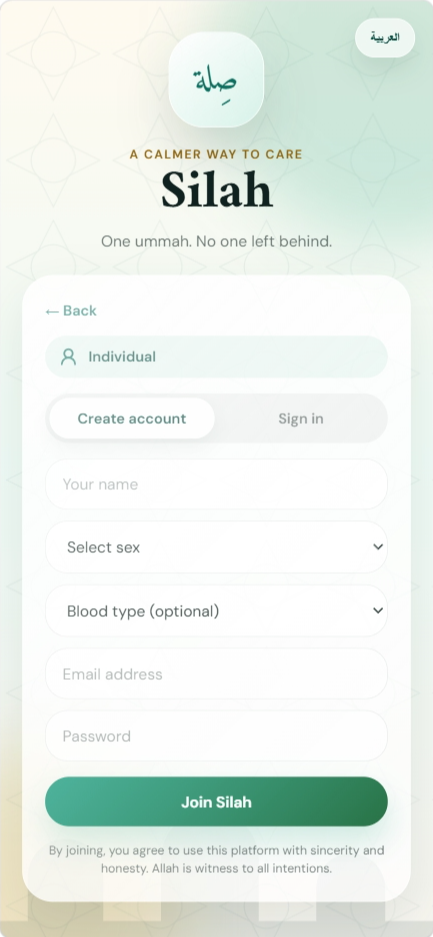
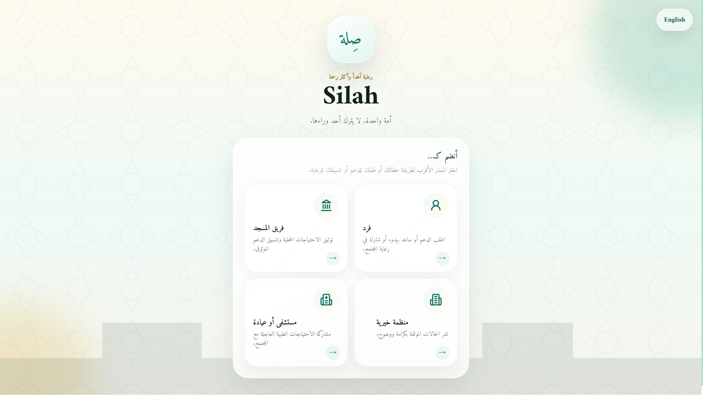

> *"The believers in their mutual kindness are like one body."* — Sahih Muslim

---

## The Problem

| | |
|---|---|
| 🛡️ **Loss of dignity** | Families feel shame publicizing their struggles |
| 📵 **Digital divide** | Many lack the data required to use modern apps |
| 🔍 **Lack of trust** | Donors unsure if money goes to the stated cause |

---

## Features

### 🗺️ Ighatha Map
Live map of verified local needs. Filter by type, donate money or volunteer time.

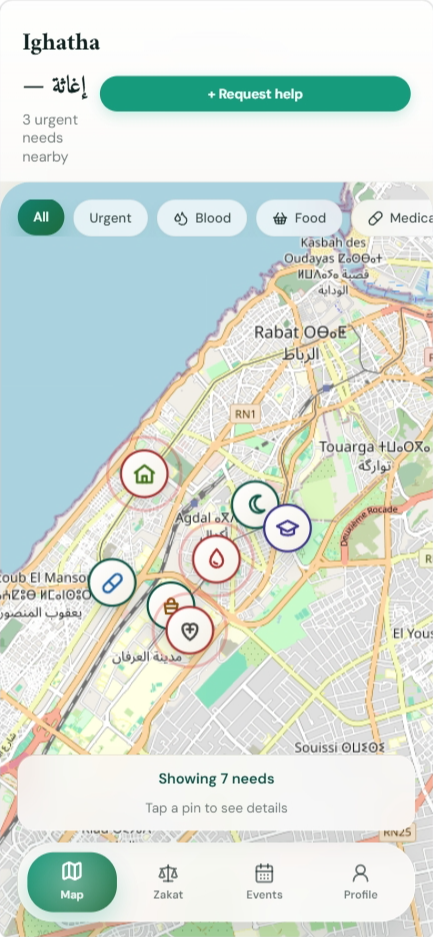

---

### 🛡️ Dignity Shield
Vulnerable individuals never post publicly. A Trust Node (Masjid or NGO) verifies offline and posts anonymously on their behalf.

```
Person in need → Visits imam → Verified offline → Posted anonymously → Appears on map
```

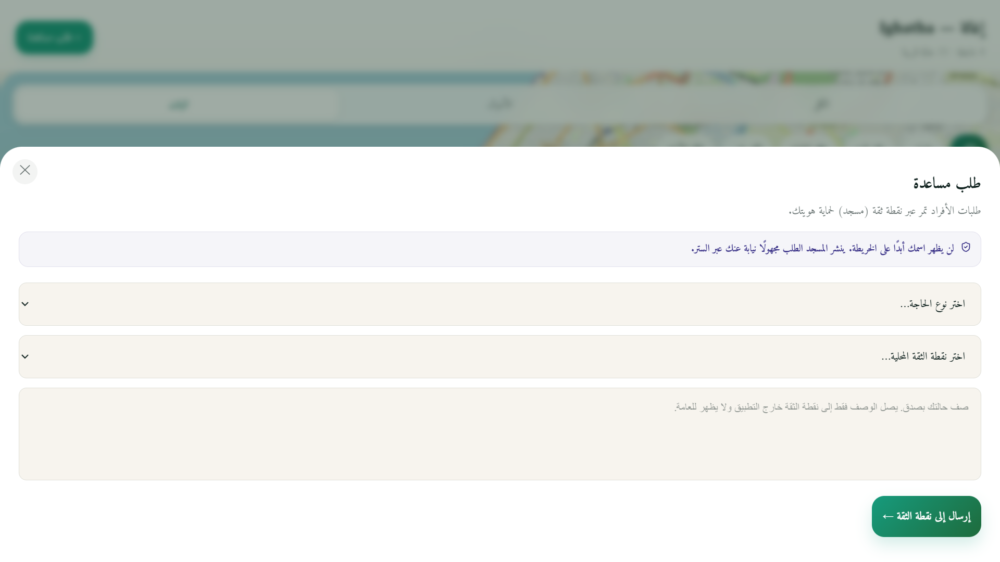

---

### ⏱️ Time Waqf
No money? Donate your time. Offer a ride, tutoring, or translation — your time is Sadaqa.

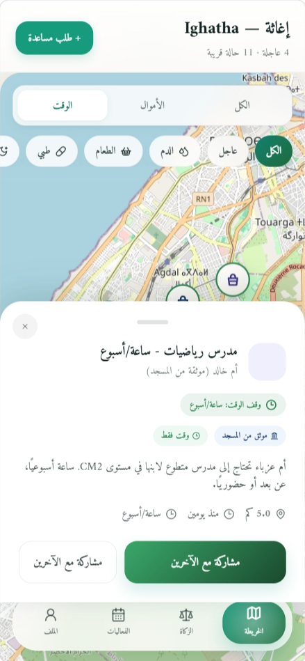

---

### 🩸 Emergency Blood Ping
Hospital posts urgent blood need → Silah pings only matching blood-type users within 5km instantly.

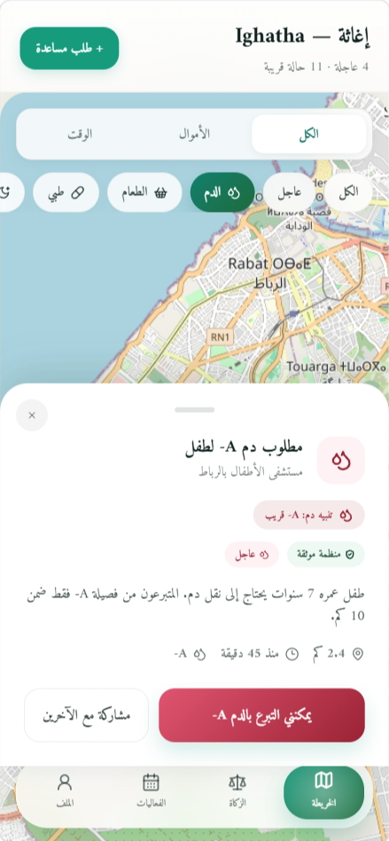

---

### 🤖 AI Micro-Grant Verification
Upload a pharmacy bill or invoice → AI verifies and locks the donation to exactly that amount.

---

### ⚖️ Zakat Engine
Calculate your Zakat, then distribute directly to verified needs on the map in one flow.

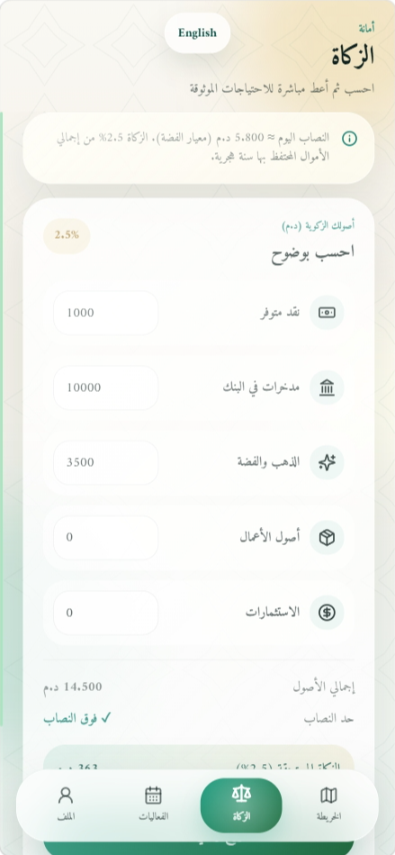

---

### 🌙 Daily Companion
Ayah of the day, Dhikr counter, and Sunnah challenge — every time you open the app.

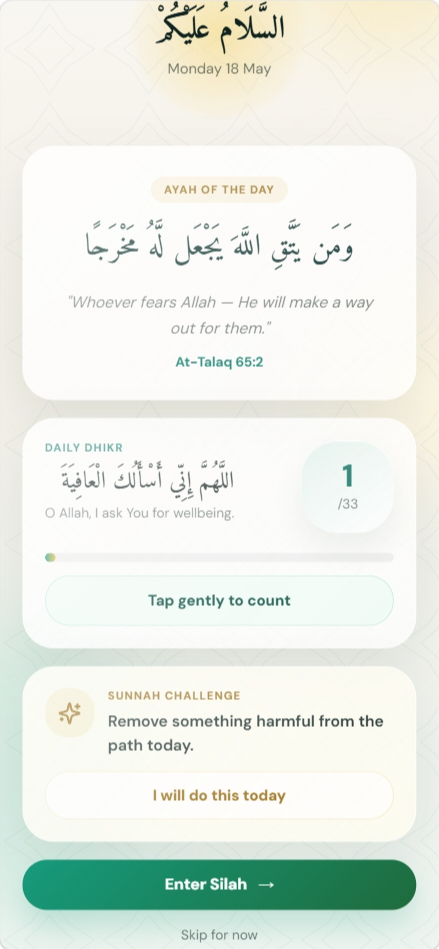

---

### 🕌 Events
Join Fajr Jama'a, halaqas, sisters' circles, and volunteer days near you.

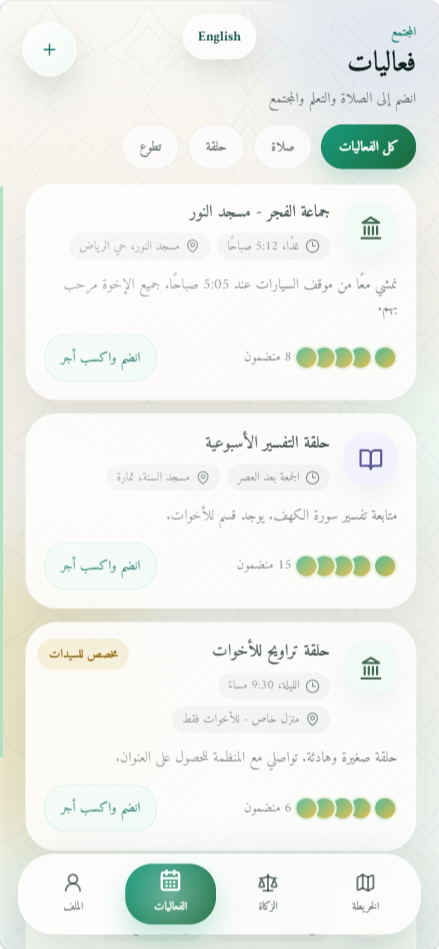

---

### 🌳 Impact Tree
After you give, the app updates you when the story progresses — months later.

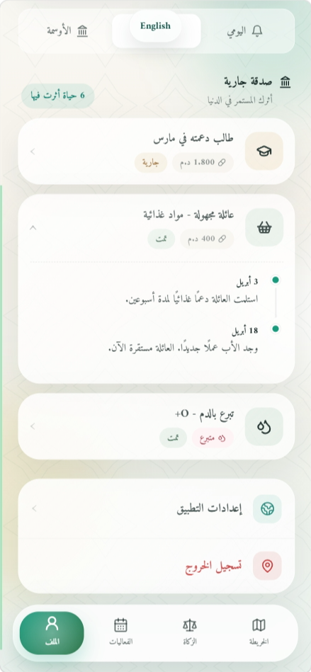

---

### ✅ Daily Checklist + Weekly Report
Track your 5 prayers, Quran, dhikr, and personal goals. Get a weekly improvement report.

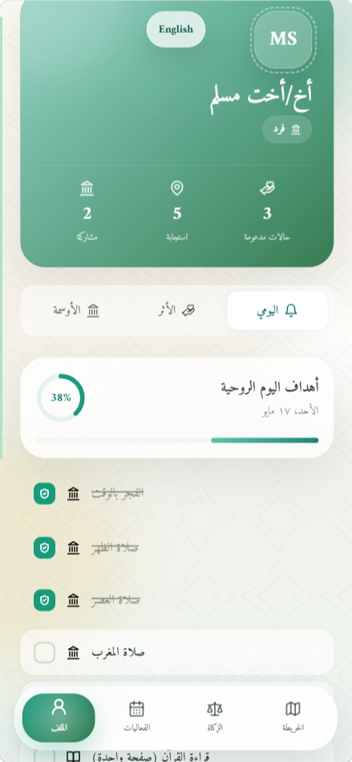
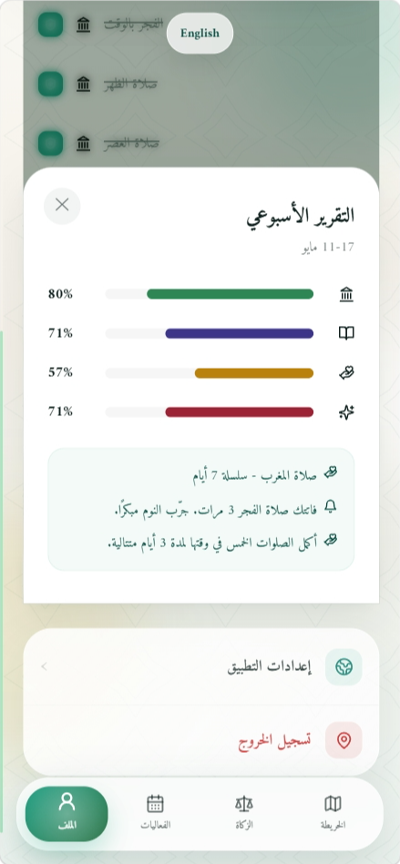

---

## Offline Mode

| Situation | Solution |
|---|---|
| No phone | Walk to masjid — imam submits on their behalf |
| Phone, no data | SMS to local number creates a draft request |
| Low-cost phone | App caches map locally, syncs when reconnected |

---

## Tech Stack

| Layer | Technology |
|---|---|
| Frontend | React Native + Expo |
| Styling | StyleSheet / NativeWind |
| Map | react-native-maps |
| Database | Supabase |
| Offline | AsyncStorage + SQLite |
| SMS fallback | Africa's Talking |
| Deployment | App Store + Play Store |

---

## Getting Started

```bash
git clone https://github.com/Aicha-Laribia/Silah.git
cd Silah
npm install
npm run dev
```

---

## Project Structure

```
silah/
└── src/
    ├── data/mockData.js
    ├── hooks/useApp.jsx
    └── components/
        ├── auth/LoginScreen.jsx
        ├── layout/BottomNav.jsx
        └── screens/
            ├── DailyScreen.jsx
            ├── MapScreen.jsx
            ├── ZakatScreen.jsx
            ├── EventsScreen.jsx
            └── ProfileScreen.jsx
```

---

## Team

**LARIBIA Aicha** — Team 9 · Hack for Good 🏆 3rd Place

---

## License

MIT — see [LICENSE](LICENSE)

---

<div align="center">

*"وَتَعَاوَنُوا عَلَى الْبِرِّ وَالتَّقْوَىٰ"*

</div>